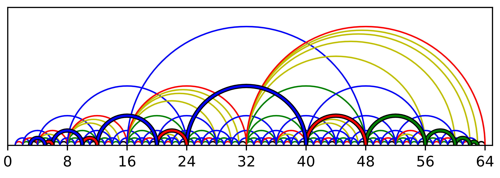

# RainbowList

An implementation of Rainbow Lists, which are pure lists with O(log(i)) indexing and constant-time cons.

See [this blog post](https://medium.com/p/a607d06234e0).

### Files
- [rainbowList.py](./rainbowList.py): Original implementation.
- [rainbowList_noY.py](./rainbowList_noY.py): Optimized to use only 3 shortcuts per node.
- [rainbowList.ipynb](./rainbowList.ipynb): Jupyter notebook for experiments/diagrams.
